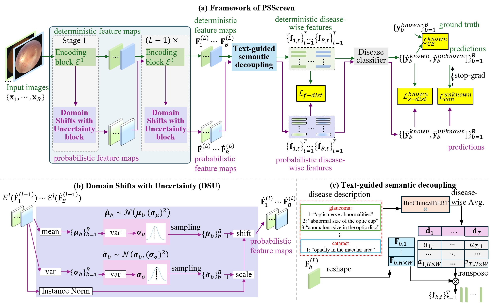

# PSScreen: Partially Supervised Multiple Retinal Disease Screening

This repository is the official implementation of paper: PSScreen: Partially Supervised Multiple Retinal Disease Screening

Fully supervised training on fully annotated datasets remains the dominant approach for developing multiple retinal disease screening models; however, acquiring such datasets is costly and demands expert medical annotation. An effective alternative is to leverage multiple open-access partially labeled datasets to train a universal screening model. However, two key challenges must be addressed: domain shifts among training data result in unreliable pseudo labels, and the model fails to recognize out-of-distribution data. We propose PSScreen, a novel partially supervised two-stream network for multiple retinal disease screening. Specifically, one stream retains deterministic feature maps, while the other adds uncertainty estimation to representations to generate probabilistic feature maps. With textual guidance, global feature maps are decoupled into disease-wise features and aligned across streams, enabling the model to generalize to various and even unseen domains, thus addressing both challenges simultaneously. Furthermore, to prevent the loss of semantic discriminative information in probabilistic feature maps from compromising pseudo label consistency regularization, we introduce a self-distillation for consistency. Experiments show that our method significantly enhances performance and achieves state-of-the-art results on multiple in-domain and out-of-domain datasets.



## Environment

- python: 3.9.19
- pytorch: 2.4.0
- numpy: 1.24.3
- pandas: 2.2.3
- scikit-learn: 1.5.0
- albumentations: 1.0.1
- opencv-python

## Dataset

We provide preprocessed datasets, which you can download from [here](https://unioulu-my.sharepoint.com/:u:/g/personal/bzheng24_univ_yo_oulu_fi/EQcP3HJjQWFGmJML23jKabsBwa61wrrwgsLMx8VyKD8Hug?e=uWrBe1).


## Training

```sh
bash ./scripts/run.sh
```

## Evaluation

```sh
bash ./scripts/test.sh
```
## Checkpoint

The pretrained weights of the following models are available at this [link]

## Acknowledgment

The code is based on [HCP-MLR-PL](https://github.com/HCPLab-SYSU/HCP-MLR-PL/tree/main). Thanks for their contributions.


